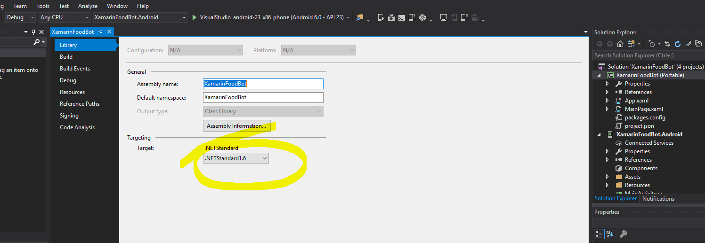
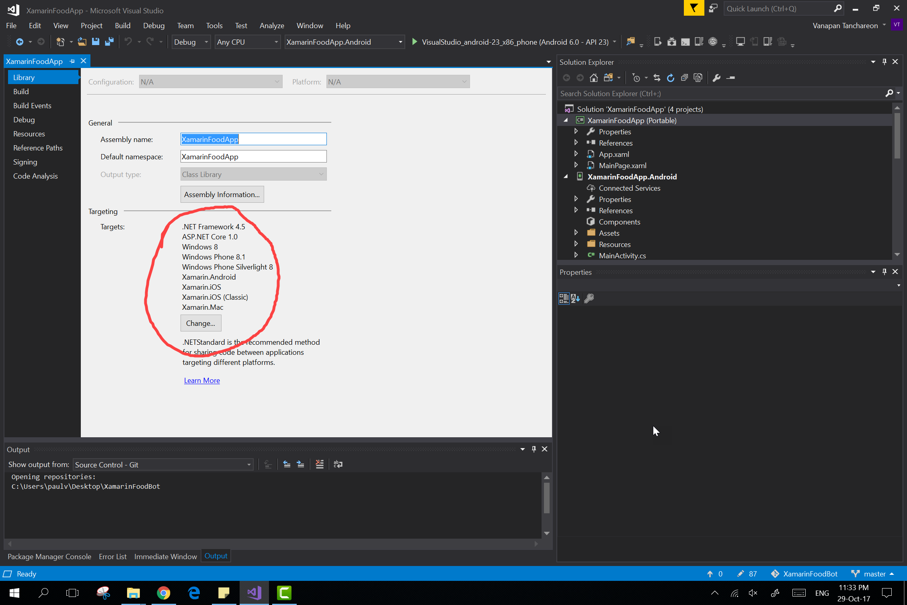

# Additional Features 
## Interaction with a mobile, cross platform app 

### Preface

So, you have decided to choose interaction with a mobile, cross platform app as your addition feature. Great choice! Today, we will be looking at how we can integrate your __Microsoft Bot Framework__ with __Xamarin.Forms__ application natively using Direct Line API. Time to take your caht bot on mobile with you with the power of Xamarin!

### Introduction

1. First you need to download the starting base project from this repository here. This is because **Microsoft.Bot.Connector.DirectLine** library that allows us to implement C# classes for using the Bot Framework Direct Line REST API __cannot__ be added to Portable Class Library directly. Therefore for an easier start, we have modified the project properties to target to .NET Platform Standard for you. 

  

  
<u>At the end of the re-target process or downloaded base project, in the properties tab of your Portable Class, it should be targeting .NETStandard1.6 </u>

&#x26a0; _If however the base project doesn't work for you or you would like to start from scratch, then follow the steps below._

<!--- Starting from scratch instructions section --->

  

    <b> Starting from Scratch </b>
    

     
    

    1. Create the new Xamarin.Forms project by opening up Visual Studio 2017, then <b>File -> New -> Project... -> Cross Platform App (Xamarin) -> Blank App.</b> 

<ul>
<li>UI Technology -> <b>Xamarin.Forms</b></li>
<li>Code Sharing Strategy -> <b>Portable Class Library (PCL)</b></li>
</ul>

2. Examining the current target framework for your portable class it should be as per below screenshot or similar. We need to re-target this to .NET Standard instead for <b>Microsoft.Bot.Connector.DirectLine</b> to work.

 

 
 
3. First remove xamarin.forms - 

