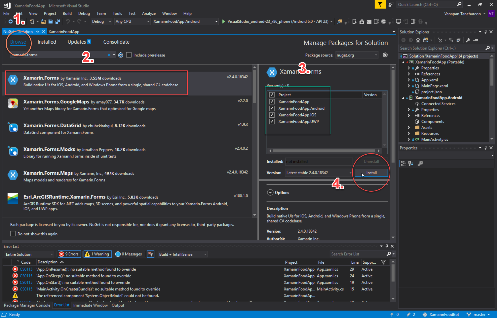
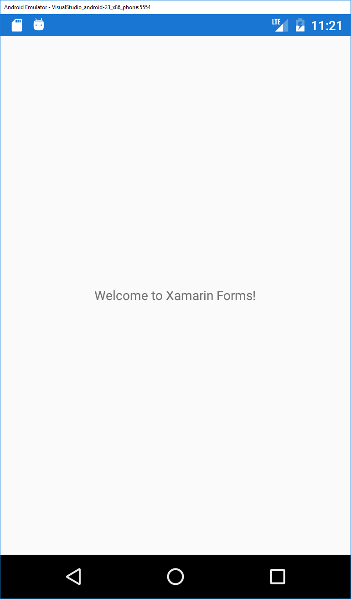
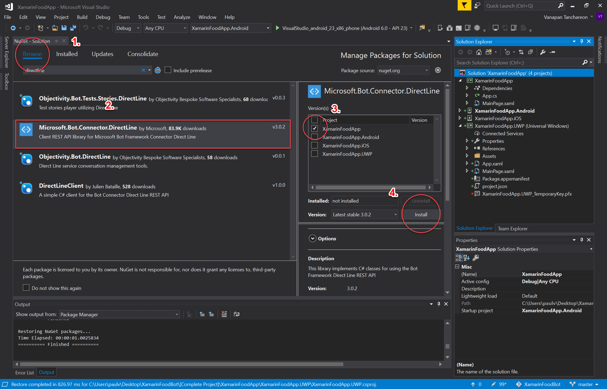
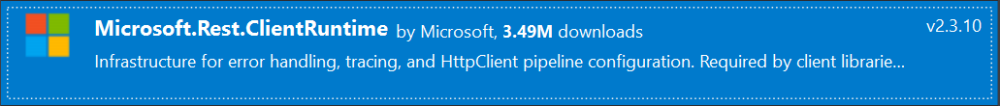
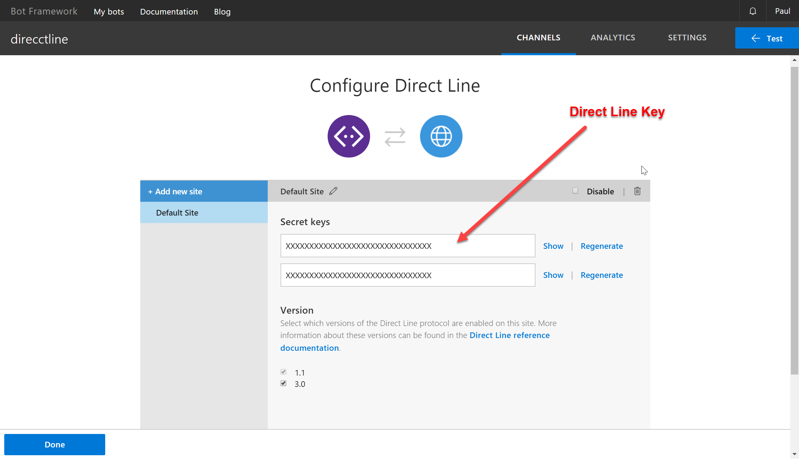

# Additional Features 
## Interaction with a mobile, cross platform app 

<p align="center"></p>

### Introduction

As one of the requirement, you have an option of choosing interaction with a mobile, cross platform app as your additional feature. Today, we will be looking at how we can integrate your __Microsoft Bot Framework__ with __Xamarin.Forms__ application natively using Direct Line API, so you can take your chat bot on mobile with you with the power of Xamarin!

### Introduction

<h3>Step 1. Getting Direct Line API up and running.</h3>

<!--- Starting from scratch instructions section --->
<details>
  <summary>
    <b>Starting from Scratch (Optional)</b>
    </summary>
    <h3>Manually Re-target Framework</h3>
    <p>
    i. Create the new Xamarin.Forms project by opening up Visual Studio 2017, then <b>File -> New -> Project... -> Cross Platform App (Xamarin) -> Blank App.</b> </p>
<ul>
<li>UI Technology -> <b>Xamarin.Forms</b></li>
<li>Code Sharing Strategy -> <b>Portable Class Library (PCL)</b></li>
</ul>
<p align="center"></p>


<p>ii. Examining the current target framework for your portable class it should be as per below screenshot or similar. For <b>Microsoft.Bot.Connector.DirectLine</b> to work we need to re-target this to .NET Standard instead.</p>

 <p align="center"></p>
 
 <p>iii. We can not simply just 'change' the Targets framework as Xamarin.Forms library in PCL is not supported by .NET Standard. We first need to <b>remove Xamarin.Forms from our projects.</b></p> 
 
<p>This can be done by going into <b>NuGet Package Manager</b> of our solution and delete Xamarin.Forms from all the projects. </p>

<p align="center"></p>

<p>iv. Take the project.json file from this repo, and add it to the Portable Class Library (PCL). Then re-check properties tab, the PCL now should be targeting <b>.NETStandard1.6</b>, which works with <b>Microsoft.Bot.Connector.DirectLine.</b></p>

<p align="center"></p>

<p>v. Go back to NuGet Package Manager window for your project, in the browse tab search for Xamarin.Forms and re-add it to all the projects.</p>

<p align="center"></p>

<p>vi. Test your app on the emulator. If there's no issue, you are ready to move on to the next step. </p>

<p align="center"></p>

<p align="center"> <b> End </b></p>
</details>

<br>
<h4> Staring from Base Project</h4>

1. First you need to download the starting base project from this repository here. This is because **Microsoft.Bot.Connector.DirectLine** package that allows us to implement C# classes for using the Bot Framework Direct Line REST API __cannot__ be added to Portable Class Library directly. 

   Therefore for an easier start, we have modified the project properties to target to .NET Platform Standard for you. 

  <p align="center"></p>
  <p align="center"><u>At the end of the re-target process or opening downloaded base project, in the properties tab of your Portable Class, target should be .NETStandard1.6 </u></p>

&#x26a0; _If however the base project doesn't work for you or you would like to start from scratch, then follow the steps in 'Starting from Scratch._

<br>

2. Now, to add the **Microsoft.Bot.Connector.DirectLine** NuGet package into the project, go to the NuGet Package Manager of your project. Browse to Microsoft.Bot.Connector.DirectLine, and install it to the .NetStandard project in your solution.

The two packages you should have installed on .NetStandard projects are.

* __Microsoft.Bot.Connector.DirectLine__
* __Microsoft.Rest.ClientRuntime__

<p align="center"></p>

<p align="center"></p>

  <p align="center"><b>Make sure your app is still working by testing it on the emulator.</b></p>


<h3>Step 2. Handling the Direct Line Connection.</h3>

<p>We will use <b>BotConnection.cs</b> class to help us connects Xamarin app to our bot through Direct Line channel. The Direct Line NuGet package abstracts away the need to write HTTP calls manually. This enable us to easily implement methods to send and receive messages with the bot.</p>

1. Add a new class called `BotConnection.cs` to the .NetStandard class library. (Right Click .NetStandard project -> Add -> Class...)

2. At the top of the file, import Direct Line NuGet package namespace to use its classes and methods.

  ```using Microsoft.Bot.Connector.DirectLine;```

3. Initialize the following 3 variables. 

  The __Client__ object is our ``DirectLineClient`` object instantiated with our bot direct line key.

```
class BotConnection
{
    public DirectLineClient Client = new DirectLineClient("xxxxx"); //DirectLine key
    public Conversation MainConversation;
    public ChannelAccount Account;
    ...
}
``` 

<p align="center"></p>

__! The direct line key is obtained from your Bot Framework portal.__

4. Next we will create a class constructor, which initialize our other two variables. 

  `MainConversation` and `Account` are initialized to store information about the current conversation and the user.

```
class BotConnection
{
  ...
    public BotConnection(string accountName)
    {
        MainConversation = Client.Conversations.StartConversation();
        Account = new ChannelAccount { Id = accountName, Name = accountName };
    }
  ...
}
```