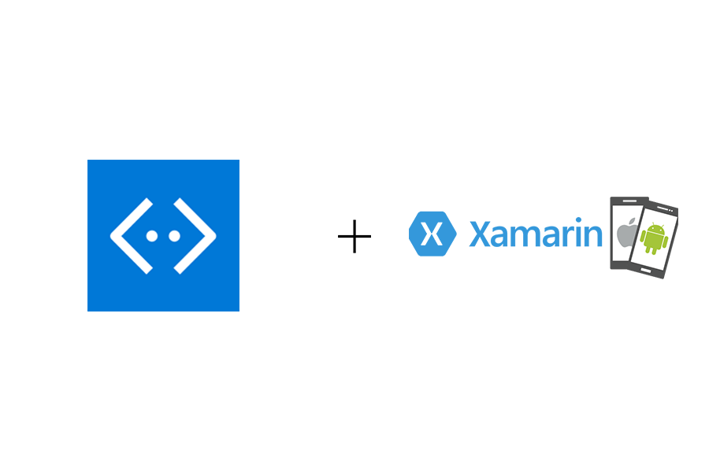

# Additional Features 
## Interaction with a mobile, cross platform app 

### Preface

So, you have decided to choose interaction with a mobile, cross platform app as your addition feature. Great choice! Today, we will be looking at how we can integrate your __Microsoft Bot Framework__ with __Xamarin.Forms__ application natively using Direct Line API. Time to take your chat bot on mobile with you with the power of Xamarin!

### Introduction

<h3>Getting Direct Line API up and running.</h3>

1. First you need to download the starting base project from this repository here. This is because **Microsoft.Bot.Connector.DirectLine** library that allows us to implement C# classes for using the Bot Framework Direct Line REST API __cannot__ be added to Portable Class Library directly. 

   Therefore for an easier start, we have modified the project properties to target to .NET Platform Standard for you. 

  

  
<u>At the end of the re-target process or opening downloaded base project, in the properties tab of your Portable Class, target should be .NETStandard1.6 </u>

&#x26a0; _If however the base project doesn't work for you or you would like to start from scratch, then follow the steps below._

<!--- Starting from scratch instructions section --->

  

    <b>Starting from Scratch</b>
    

    <h3>Manually Re-target Framework</h3>
    

    1. Create the new Xamarin.Forms project by opening up Visual Studio 2017, then <b>File -> New -> Project... -> Cross Platform App (Xamarin) -> Blank App.</b> 

<ul>
<li>UI Technology -> <b>Xamarin.Forms</b></li>
<li>Code Sharing Strategy -> <b>Portable Class Library (PCL)</b></li>
</ul>

2. Examining the current target framework for your portable class it should be as per below screenshot or similar. For <b>Microsoft.Bot.Connector.DirectLine</b> to work we need to re-target this to .NET Standard instead.

 

 
 
3. We can not simply just 'change' the Targets framework as Xamarin.Forms library in PCL is not supported by .NET Standard. We first need to <b>remove Xamarin.Forms from our projects.</b>
 
 

This can be done by going into <b>NuGet Package Manager</b> of our solution and delete Xamarin.Forms from all the projects. 

4. Take the project.json file from this repo, and add it to the Portable Class Library (PCL). Then re-check properties tab, the PCL now should be targeting <b>.NETStandard1.6</b>, which works with <b>Microsoft.Bot.Connector.DirectLine.</b>

 
<u><b>Test your app on the emulator. If there's no issue, you are ready to move on to the next step. </b></u>

