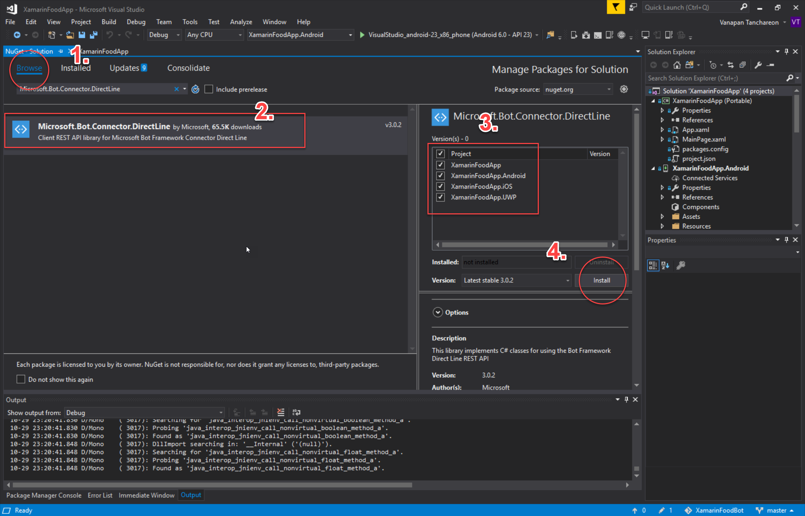
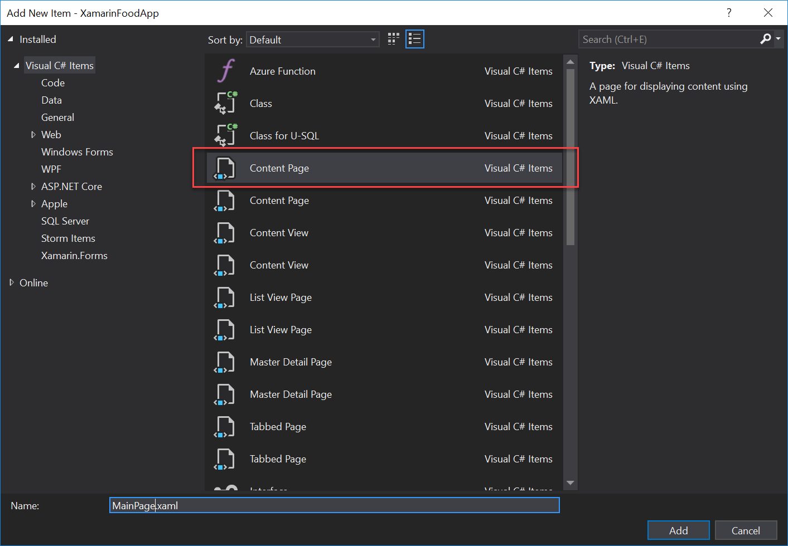

# Additional Features 
## Interaction with a mobile, cross platform app 

<p align="center"></p>

### Introduction

As one of the requirement, you have an option of choosing interaction with a mobile, cross platform app as your additional feature. Today, we will be looking at how we can integrate your __Microsoft Bot Framework__ with __Xamarin.Forms__ application natively using Direct Line API, so you can take your chat bot on mobile with you with the power of Xamarin!

### Introduction

<h3>Step 1: Getting Direct Line API up and running.</h3>

<!--- Starting from scratch instructions section --->
<details>
  <summary>
    <b>Starting from Scratch (Optional)</b>
    </summary>
    <h3>Manually Re-target Framework</h3>
    <p>
    i. Create the new Xamarin.Forms project by opening up Visual Studio 2017, then <b>File -> New -> Project... -> Cross Platform App (Xamarin) -> Blank App.</b> </p>
<ul>
<li>UI Technology -> <b>Xamarin.Forms</b></li>
<li>Code Sharing Strategy -> <b>Portable Class Library (PCL)</b></li>
</ul>
<p align="center"></p>


<p>ii. Examining the current target framework for your portable class it should be as per below screenshot or similar. For <b>Microsoft.Bot.Connector.DirectLine</b> to work we need to re-target this to .NET Standard instead.</p>

 <p align="center"></p>
 
 <p>iii. We can not simply just 'change' the Targets framework as Xamarin.Forms library in PCL is not supported by .NET Standard. We first need to <b>remove Xamarin.Forms from our projects.</b></p> 
 
<p>This can be done by going into <b>NuGet Package Manager</b> of our solution and delete Xamarin.Forms from all the projects. </p>

<p align="center"></p>

<p>iv. Take the project.json file from this repo, and add it to the Portable Class Library (PCL). Then re-check properties tab, the PCL now should be targeting <b>.NETStandard1.6</b>, which works with <b>Microsoft.Bot.Connector.DirectLine.</b></p>

<p align="center"></p>

<p>v. Go back to NuGet Package Manager window for your project, in the browse tab search for Xamarin.Forms and re-add it to all the projects.</p>

<p align="center"></p>

<p>vi. Test your app on the emulator. If there's no issue, you are ready to move on to the next step. </p>

<p align="center"></p>

<p align="center"> <b> End </b></p>
</details>

<br>
<h4> Staring from Base Project</h4>

1. First you need to download the starting base project from this repository here. This is because **Microsoft.Bot.Connector.DirectLine** package that allows us to implement C# classes for using the Bot Framework Direct Line REST API __cannot__ be added to Portable Class Library directly. 

   Therefore for an easier start, we have modified the project properties to target to .NET Platform Standard for you. 

  <p align="center"></p>
  <p align="center"><u>At the end of the re-target process or opening downloaded base project, in the properties tab of your Portable Class, target should be .NETStandard1.6 </u></p>

&#x26a0; _If however you would like to start from scratch, then follow the steps in 'Starting from Scratch._

<br>

2. Now, to add the **Microsoft.Bot.Connector.DirectLine** NuGet package into the project, go to the NuGet Package Manager of your project. Browse to Microsoft.Bot.Connector.DirectLine, and install it to the all projects in your solution.

The two packages you should have installed are.

* __Microsoft.Bot.Connector.DirectLine__
* __Microsoft.Rest.ClientRuntime__

<p align="center"></p>

<p align="center"></p>

  <p align="center"><b>Make sure your app is still working by testing it on the emulator.</b></p>


<h3>Step 2: Handling the Direct Line Connection.</h3>

<p>We will use <b>BotConnection.cs</b> class to help us connects Xamarin app to our bot through Direct Line channel. The Direct Line NuGet package abstracts away the need to write HTTP calls manually. This enable us to easily implement methods to send and receive messages with the bot.</p>

1. Add a new class called `BotConnection.cs` to the .NetStandard class library. (Right Click .NetStandard project -> Add -> Class...)

2. At the top of the file, import Direct Line NuGet package namespace to use its classes and methods.

  ```using Microsoft.Bot.Connector.DirectLine;```

3. Initialize the following 3 variables. 

  The __Client__ object is our ``DirectLineClient`` object instantiated with our bot direct line key.

```
class BotConnection
{
    public DirectLineClient Client = new DirectLineClient("xxxxx"); //DirectLine key
    public Conversation MainConversation;
    public ChannelAccount Account;
    ...
}
``` 

<p align="center"></p>

__! The direct line key is obtained from your Bot Framework portal.__

4. Next we will create a class constructor, which initialize our other two variables. 

  `MainConversation` and `Account` are initialized to store information about the current conversation and the user.

```
class BotConnection
{
  ...
    public BotConnection(string accountName)
    {
        MainConversation = Client.Conversations.StartConversation();
        Account = new ChannelAccount { Id = accountName, Name = accountName };
    }
  ...
}
```

5. Create a `SendMessage()` method to handle sending our message to the bot.

  The activity object containing the string message and other info is created in this case. We then called the `PostActivity()` method on the Client object. 
  
  By passing in the current `ConversationId` and the `activity` objects, they will be sent over to the current conversation we initialized. 

```
public void SendMessage(string message)
{
    Activity activity = new Activity
    {
        From = Account,
        Text = message,
        Type = ActivityTypes.Message
    };
    Client.Conversations.PostActivity(MainConversation.ConversationId, activity);
}
```


<h3> Step3: Handling the data binding & storing messages.</h3>

1. Create another class (Right Click .NetStandard project -> Add -> Class...), and call it __MessageListItem__.

  This class will help with data collection and binding. It helps displays our messages to the UI. The method binds text to the elements in xmal ContentPage that we will work on in the later section.


```
    class MessageListItem
    {
        public string Text { get; set; }
        public string Sender { get; set; }


        //This method bind data to element in xaml UI ContentPage.
        public MessageListItem(string text, string sender)
        {
            Text = text;
            Sender = sender;
        }
    }
```

  The object of MessageListItem will be stored in `ObservableCollection` messageList object we will create and use later for holding the messages.

<h3> Step4: Handling Retreiving & Checking for New Messages from the Server. </h3> 

1. This method starts a loop that periodically check for any new messages. The method takes in `ObservableCollection` object so we can push messages we retrieve from the bot to our collection.

  We will write a `Send()` method to display the messages to the UI later.

2. The `var activitySet` object periodically pulled from the bot server contains messages.

3. We check for each `activity` object in the `activitySet` object for messages from the bot, and add them to the `MessageListItem` object. 

  With the help of `MessageListItem` class, the message will be displayed on the UI.

4. The method wait 3 seconds then check again. 

```
public async Task GetMessagesAsync(ObservableCollection<MessageListItem> collection)
{
    string watermark = null;

    //Loop retrieval
    while(true)
    {
        Debug.WriteLine("Reading message every 3 seconds");

        //Get activities (messages) after the watermark
        var activitySet = await Client.Conversations.GetActivitiesAsync(MainConversation.ConversationId, watermark);

        //Set new watermark
        watermark = activitySet?.Watermark;

        //Loop through the activities and add them to the list
        foreach(Activity activity in activitySet.Activities)
        {
            if (activity.From.Name == "MSAFoodBot")
            {
                collection.Add(new MessageListItem(activity.Text, activity.From.Name));
            }             
        }

        //Wait 3 seconds
        await Task.Delay(3000);
    }
}
``` 

⭐ **__Your final `BotConnection.cs` should looks something similar to below.__**

```
using System;
using System.Collections.Generic;
using System.Text;
using Microsoft.Bot.Connector.DirectLine;
using System.Threading.Tasks;
using System.Collections.ObjectModel;
using System.Diagnostics;

namespace XamarinFoodApp
{
    class BotConnection
    {
        public DirectLineClient Client = new DirectLineClient("VDiY87OEgwo.cwA.N9k.oCy0yVt8Mc7K90Zmol8UIn8SF95Cn9wK_zPJjIdMY2s"); //DirectLine key
        public Conversation MainConversation;
        public ChannelAccount Account;

        public BotConnection(string accountName)
        {
            MainConversation = Client.Conversations.StartConversation();
            Account = new ChannelAccount { Id = accountName, Name = accountName };
        }

        public void SendMessage(string message)
        {
            Activity activity = new Activity
            {
                From = Account,
                Text = message,
                Type = ActivityTypes.Message
            };
            Client.Conversations.PostActivity(MainConversation.ConversationId, activity);
        }

        public async Task GetMessagesAsync(ObservableCollection<MessageListItem> collection)
        {
            string watermark = null;

            //Loop retrieval
            while (true)
            {
                Debug.WriteLine("Reading message every 3 seconds");

                //Get activities (messages) after the watermark
                var activitySet = await Client.Conversations.GetActivitiesAsync(MainConversation.ConversationId, watermark);

                //Set new watermark
                watermark = activitySet?.Watermark;

                //Loop through the activities and add them to the list
                foreach (Activity activity in activitySet.Activities)
                {
                    if (activity.From.Name == "MSAFoodBot")
                    {
                        collection.Add(new MessageListItem(activity.Text, activity.From.Name));
                    }
                }

                //Wait 3 seconds
                await Task.Delay(3000);
            }
        }


    }
}
```

<h3> Step 4: Creating the interface for our app </h3>

1. We will use ContentPage to create a UI for the user to interact with the bot. If `MainPage.xmal` is not added yet right click .NetStandard project -> Add -> New Item... ->  Content Page.

<p align="center"></p>

2. We use the `StackLayout` to position elements in our XAML, as well as allowing us to set padding, vertical and horizontal properties.

  * `ListView` is used to display the timeline of messages between the user and the bot.

  * The `TextCell` is a simple cell type that has text and detail properties. `Binding Text` and `Binding Sender` are two properties from the custom MessageListItem class we created. This will allow us to bind the messages to these elements and display them to the user.

3. 'Entry' is a text-field where user can type message. When the user tap Enter, `Completed="Send"` will trigger a method `Send()`, which takes care of sending the message to the bot. We will implement the `Send()` method in the upcoming section. 

⭐ **__Your final `MainPage.xaml` should looks something similar to below.__**

```
<?xml version="1.0" encoding="utf-8" ?>
<ContentPage xmlns="http://xamarin.com/schemas/2014/forms"
             xmlns:x="http://schemas.microsoft.com/winfx/2009/xaml"
             xmlns:local="clr-namespace:App6"
             x:Class="App6.MainPage">

    <StackLayout Spacing="10" Padding="10" HorizontalOptions="Fill" VerticalOptions="Fill" Orientation="Vertical">
   
            <ListView x:Name="MessageListView"
                 VerticalOptions="FillAndExpand"
                 HorizontalOptions="Fill"
                 >
                <ListView.ItemTemplate>
                    <DataTemplate>
                        <TextCell Text="{Binding Text}" Detail="{Binding Sender}" />
                    </DataTemplate>
                </ListView.ItemTemplate>
            </ListView>

        <Entry Placeholder="Message"
        VerticalOptions="End"
        HorizontalOptions="Fill"
        HorizontalTextAlignment="End"
        Completed="Send"
        />
    </StackLayout>

</ContentPage>
```


<h3> Step 5: Connecting the Bot to the XAML Page of the Xamarin App </h3>

1. Now that we have implemented all the logic to handle the interaction with the bot, including a simple UI. It is time to put it all together.

2. In the `MainPage.xaml.cs` initialize a connection object using the `BotConnection()` method from the class we created.

```
//Initialize a connection with ID and Name
BotConnection connection = new BotConnection("Paul");
```

3. Initialize a `ObservableCollection` object containing objects of type `MessageListItem` to store our messages.

```
ObservableCollection<MessageListItem> messageList = new ObservableCollection<MessageListItem>();
```

3. Next, we need to implement a `Send()` methods, which takes care of taking the text the user types, and calling the method `SendMessage()` on the connection object from `BotConnection` class we implemented earlier.  

  The message is also placed into the ListView.
```
public void Send(object sender, EventArgs args)
{
        //Get text in entry
        var message = ((Entry)sender).Text;

        if(message.Length > 0)
        {
            //Clear entry
            ((Entry)sender).Text = "";

            //Make object to be placed in ListView
            var messageListItem = new MessageListItem(message, connection.Account.Name);
            messageList.Add(messageListItem);

            //Send the message to the bot
            connection.SendMessage(message);
        }
}
```
<br>

⭐ **__Your final `MainPage.xaml.cs` should looks something like this.__**

```
using System;
using System.Collections.Generic;
using System.Collections.ObjectModel;
using System.Linq;
using System.Text;
using System.Threading.Tasks;

using Xamarin.Forms;
using Xamarin.Forms.Xaml;

namespace XamarinFoodApp
{
	[XamlCompilation(XamlCompilationOptions.Compile)]
	public partial class MainPage : ContentPage
	{
        //Initialize a connection with ID and Name
        BotConnection connection = new BotConnection("Paul");

        //Initialize a collection object to hold the mesaages.
        ObservableCollection<MessageListItem> messageList = new ObservableCollection<MessageListItem>();

        public MainPage ()
		{
			InitializeComponent ();
		}

        //Send() method takes the user input and send it to the bot server.
        public void Send(object sender, EventArgs args)
        {
            //Get text in entry
            var message = ((Entry)sender).Text;

            if (message.Length > 0)
            {
                //Clear entry
                ((Entry)sender).Text = "";

                //Make object to be placed in ListView
                var messageListItem = new MessageListItem(message, connection.Account.Name);
                messageList.Add(messageListItem);

                //Send the message to the bot
                connection.SendMessage(message);
            }
        }

    }
}
```